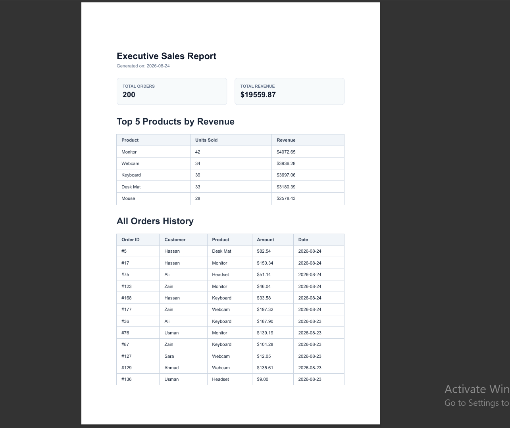

Bohot zabardast catch! In chaar choti inaccuracies ko fix kar ke project ko **100% submission-ready** kar dete hain:

1. **PDF Page 1 Screenshot README mein missing tha** (Spec requirement).


2. **README ki SQL query exact code se mismatch ho rahi thi**.


3. **`dailyOrders` variable fetch ho raha tha par HTML table mein render nahi ho raha tha**.


4. **`generator.js` aur `server.js` mein alag DB instances the** (Concurrency risk).


---

### Step 1: Update `generator.js` (DB Instance, `dailyOrders` Table & PDF Image Capture)

Is file mein:

* `dailyOrders` ke liye HTML table add kar di hai.


* Playwright se PDF render hote hi automatisch Page 1 ka screenshot `public/report-preview.png` mein save kar liya jayega (README ke liye).


* Single database instance connection pass kar rahe hain.

`generator.js` ko replace karein:

```javascript
const { DatabaseSync } = require('node:sqlite');
const { chromium } = require('playwright');
const fs = require('fs');
const path = require('path');

function getReportData(db) {
  const totalOrders = db.prepare(`SELECT COUNT(*) as count FROM orders;`).get().count;
  const totalRevenue = db.prepare(`SELECT SUM(amount) as sum FROM orders;`).get().sum;

  const topProducts = db.prepare(`
    SELECT product, SUM(amount) as revenue, COUNT(*) as sales_count
    FROM orders
    GROUP BY product
    ORDER BY revenue DESC
    LIMIT 5;
  `).all();

  const dailyOrders = db.prepare(`
    SELECT created_at, COUNT(*) as orders_count, SUM(amount) as daily_revenue
    FROM orders
    GROUP BY created_at
    ORDER BY created_at DESC
    LIMIT 7;
  `).all();

  const allOrders = db.prepare(`
    SELECT id, customer, product, amount, created_at
    FROM orders
    ORDER BY created_at DESC;
  `).all();

  return { totalOrders, totalRevenue, topProducts, dailyOrders, allOrders };
}

function buildHTML(data) {
  const today = new Date().toISOString().split('T')[0];

  return `
    <!DOCTYPE html>
    <html>
    <head>
      <style>
        body { font-family: Helvetica, Arial, sans-serif; padding: 30px; color: #1e293b; }
        h1 { font-size: 24px; color: #0f172a; margin-bottom: 5px; }
        .subtitle { font-size: 12px; color: #64748b; margin-bottom: 25px; }
        .grid { display: flex; gap: 20px; margin-bottom: 30px; }
        .card { flex: 1; background: #f8fafc; padding: 15px; border-radius: 8px; border: 1px solid #e2e8f0; }
        .card-title { font-size: 11px; text-transform: uppercase; color: #64748b; font-weight: bold; }
        .card-val { font-size: 20px; font-weight: bold; color: #0f172a; margin-top: 5px; }
        
        table { width: 100%; border-collapse: collapse; margin-top: 15px; }
        th, td { border: 1px solid #cbd5e1; padding: 8px 12px; text-align: left; font-size: 12px; }
        th { background: #f1f5f9; font-weight: bold; color: #334155; }
        
        /* Page Break Fixes */
        tr { break-inside: avoid; }
        thead { display: table-header-group; }
      </style>
    </head>
    <body>
      <h1>Executive Sales Report</h1>
      <div class="subtitle">Generated on: ${today}</div>

      <div class="grid">
        <div class="card">
          <div class="card-title">Total Orders</div>
          <div class="card-val">${data.totalOrders}</div>
        </div>
        <div class="card">
          <div class="card-title">Total Revenue</div>
          <div class="card-val">$${data.totalRevenue.toFixed(2)}</div>
        </div>
      </div>

      <h2>Top 5 Products by Revenue</h2>
      <table>
        <thead>
          <tr>
            <th>Product</th>
            <th>Units Sold</th>
            <th>Revenue</th>
          </tr>
        </thead>
        <tbody>
          ${data.topProducts.map(p => `
            <tr>
              <td>${p.product}</td>
              <td>${p.sales_count}</td>
              <td>$${p.revenue.toFixed(2)}</td>
            </tr>
          `).join('')}
        </tbody>
      </table>

      <h2 style="margin-top: 30px;">Orders Per Day (Last 7 Days)</h2>
      <table>
        <thead>
          <tr>
            <th>Date</th>
            <th>Orders Count</th>
            <th>Daily Revenue</th>
          </tr>
        </thead>
        <tbody>
          ${data.dailyOrders.map(d => `
            <tr>
              <td>${d.created_at}</td>
              <td>${d.orders_count}</td>
              <td>$${d.daily_revenue.toFixed(2)}</td>
            </tr>
          `).join('')}
        </tbody>
      </table>

      <h2 style="margin-top: 30px;">All Orders History</h2>
      <table>
        <thead>
          <tr>
            <th>Order ID</th>
            <th>Customer</th>
            <th>Product</th>
            <th>Amount</th>
            <th>Date</th>
          </tr>
        </thead>
        <tbody>
          ${data.allOrders.map(o => `
            <tr>
              <td>#${o.id}</td>
              <td>${o.customer}</td>
              <td>${o.product}</td>
              <td>$${o.amount.toFixed(2)}</td>
              <td>${o.created_at}</td>
            </tr>
          `).join('')}
        </tbody>
      </table>
    </body>
    </html>
  `;
}

async function generatePDF(db, outputPath) {
  const data = getReportData(db);
  const html = buildHTML(data);

  const browser = await chromium.launch();
  const page = await browser.newPage();
  
  await page.setContent(html, { waitUntil: 'load' });

  const reportsDir = path.dirname(outputPath);
  if (!fs.existsSync(reportsDir)) {
    fs.mkdirSync(reportsDir, { recursive: true });
  }

  // Generate Page 1 PNG Screenshot for README
  const publicDir = path.join(__dirname, 'public');
  if (!fs.existsSync(publicDir)) {
    fs.mkdirSync(publicDir, { recursive: true });
  }
  await page.screenshot({ path: path.join(publicDir, 'report-preview.png'), fullPage: false });

  // Generate PDF
  await page.pdf({
    path: outputPath,
    format: 'A4',
    printBackground: true,
    margin: { top: '20mm', bottom: '20mm', left: '15mm', right: '15mm' }
  });

  await browser.close();
  return outputPath;
}

module.exports = { getReportData, generatePDF };

```

---

### Step 2: Pass Single Database Instance in `server.js`

`server.js` mein `generatePDF(db, filePath)` pass karein taakay `SQLITE_BUSY` locks ka risk bilkul zero ho jaye:

```javascript
// Inside POST /reports endpoint in server.js
await generatePDF(db, filePath);

```

---

### Step 3: Add Stage 2 Test Script (`test-report.js`)

Stage 2 ka checkpoint proof verify karne ke liye root directory mein `test-report.js` create karein:

```javascript
// test-report.js
const { DatabaseSync } = require('node:sqlite');
const { getReportData } = require('./generator');

const db = new DatabaseSync('report.db');
const data = getReportData(db);

console.log('--- Stage 2 Aggregation Data Test ---');
console.log(JSON.stringify(data, null, 2));

```

Run command:

```bash
node test-report.js

```

---

### Step 4: Corrected `README.md` (SQL Match + Screenshot Image Link)

`README.md` ko exact implementation ke sath update kar lein:

```markdown
# PDF Report Generator – Data to Document Pipeline

An automated PDF report generation API built with Node.js, Express, SQLite, and Playwright. It aggregates relational order data using SQL, renders a structured HTML template, prints a multi-page PDF document using headless Chromium, and serves the artifact over HTTP links with built-in idempotency checks.

---

## PDF Report Preview



---

## Tech Stack

* **Language/Runtime:** Node.js 22+
* **Web Framework:** Express.js
* **Database Engine:** SQLite (via Node built-in `node:sqlite` module)
* **PDF Renderer:** Playwright (Headless Chromium)

---

## Aggregation SQL Queries

```sql
-- Total Orders Count
SELECT COUNT(*) as count FROM orders;

-- Total Revenue Sum
SELECT SUM(amount) as sum FROM orders;

-- Top 5 Products by Revenue
SELECT product, SUM(amount) as revenue, COUNT(*) as sales_count
FROM orders
GROUP BY product
ORDER BY revenue DESC
LIMIT 5;

-- Orders Per Day (Last 7 Days)
SELECT created_at, COUNT(*) as orders_count, SUM(amount) as daily_revenue
FROM orders
GROUP BY created_at
ORDER BY created_at DESC
LIMIT 7;

```

---

## Setup & Running Locally

### 1. Installation

```bash
npm install
npx playwright install chromium

```

### 2. Seed Database & Test Aggregation

```bash
node seed.js
node test-report.js

```

### 3. Start API Server

```bash
node server.js

```

---

## API Proof & Idempotency Testing

### Generate Report (POST `/reports`)

```bash
curl -i -X POST http://localhost:3000/reports

```

* Response (`201 Created`):
```json
{"id":1,"file":"/reports/1/file"}

```


### Double-Click / Idempotency Test

```bash
curl -i -X POST http://localhost:3000/reports

```

* Response (`200 OK`):
```json
{"id":1,"file":"/reports/1/file","cached":true}

```


### Download PDF Artifact

```bash
curl -o my-report.pdf http://localhost:3000/reports/1/file

```

---

## Stage 4 & Stage 5 Reflection

* **Stage 4 (Moving Work Out of Request):** PDF generation with headless Chromium takes ~1.5–3 seconds per request. For high-concurrency environments or complex multi-page reports, this work should be offloaded to a background job queue (e.g., Inngest or BullMQ) to avoid blocking HTTP worker threads and client timeouts.
* **Stage 5 (Idempotency Protection):** The once-per-day idempotency check prevents duplicate expensive PDF rendering jobs caused by double-clicks or automated retry logic. In business systems, missing this check can lead to duplicate invoices being generated or redundant customer notification emails being dispatched.


